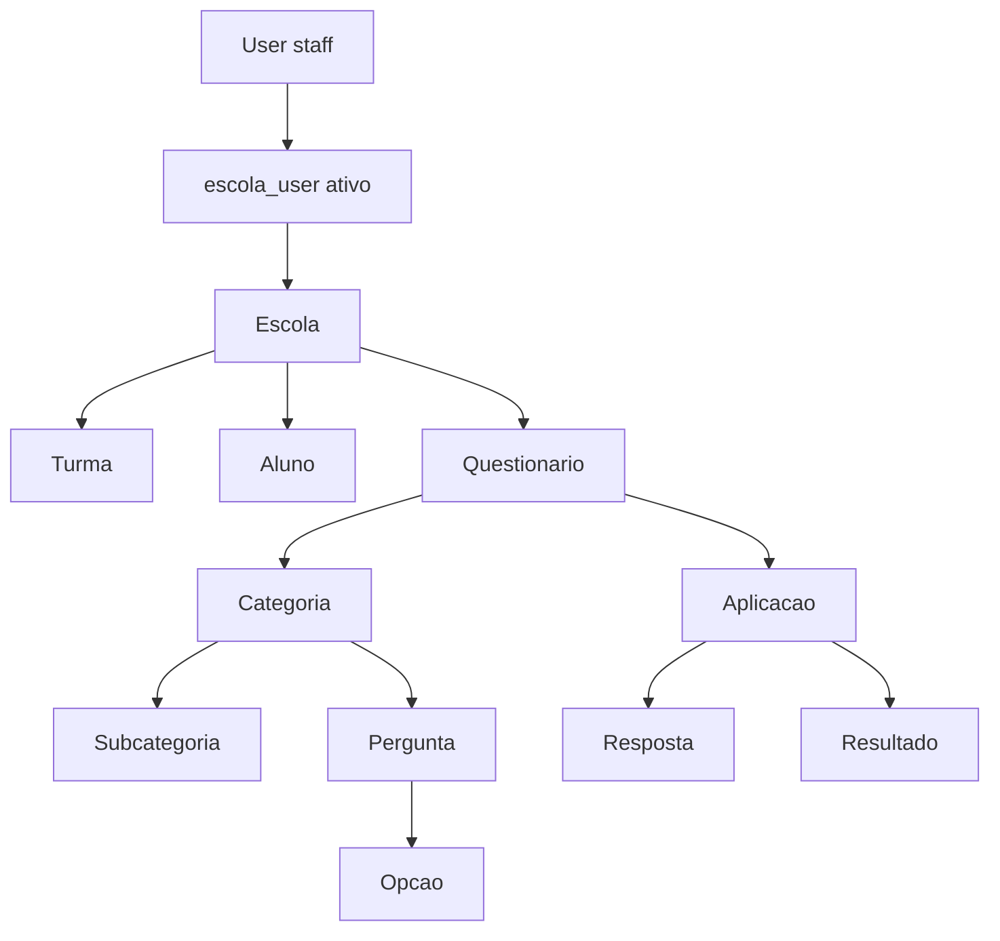
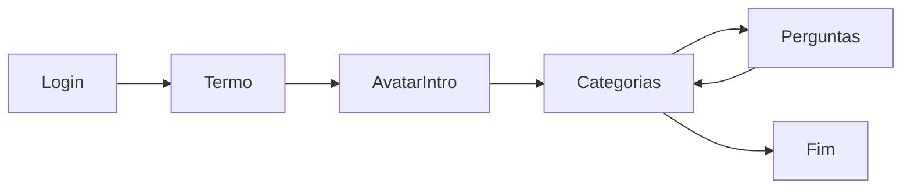
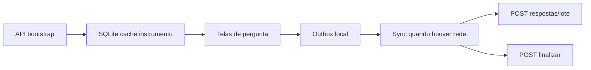

# Arquitetura e plano — Vise Saúde Mental

Workspace [`/home/jp/ViseProjetos/ViseSaudeMental`](/home/jp/ViseProjetos/ViseSaudeMental) está **vazio**. Tudo será criado do zero. O dump e os prints definem domínio e UX; o schema antigo **não** será copiado (turmas globais, categoria = questionário, sem pesquisador, sem aplicação formal).

## Decisões já fechadas

- **MVP ponta a ponta:** CMS + API + app Flutter (login aluno, categorias, perguntas, **persistência local + sync**). Fora do MVP: PDF/Excel, relatórios avançados, áudio do avatar, iOS, sync bidirecional complexo.
- **Aparelho primeiro:** respostas (e o instrumento já baixado) ficam no device e só depois sobem ao servidor — para sala de aula sem rede estável e para **apresentação/demo**.
- **Dados:** modelo novo agora; **comando Artisan de importação** previsto para rodar depois (mapeamento documentado, sem ETL na sprint 1).
- **Tenant = Escola (Organização):** mesma entidade. Cadastros acadêmicos **e** o instrumento completo (questionário → categorias → subcategorias → perguntas → opções) pertencem a uma escola.
- **Vínculo ativo:** staff só opera na escola se `escola_user.status = ativo` (e papel compatível). Sem vínculo ativo → sem acesso àquele tenant.
- **Pesquisador:** por padrão só os próprios questionários; pode marcar **compartilhado na escola** para outros pesquisadores da mesma escola.
- **Aluno nunca vê** pontuação, classificação, score ou percentual de resultado (só progresso de preenchimento: “X de Y” / “Concluído”).

## Stack

| Camada | Escolha | Motivo |
|---|---|---|
| Backend | Laravel 11, PHP 8.3, MySQL 8 | Alvo do spec; LTS atual |
| CMS | Filament 3 | Pedido “V3 ou superior”; ecossistema maduro (Resources, Relation Managers, Widgets) |
| Auth staff | Filament + sessão | Admin/escola/pesquisador/professor |
| Auth aluno | Laravel Sanctum no model `Aluno` | Igual ao legado (`tokenable` = Aluno), CPF + data de nascimento |
| Permissões | `spatie/laravel-permission` | Roles do spec sem reinventar |
| API docs | `l5-swagger` ou `scramble` | Entregável OpenAPI |
| Mobile | Flutter 3.x, Android primeiro | Material 3 + tema dark dos prints |
| Estado Flutter | Riverpod + Dio + flutter_secure_storage + Drift (SQLite) | Auth, cache do instrumento, outbox de respostas |

Monorepo:

```
ViseSaudeMental/
  backend/          # Laravel
  mobile/           # Flutter
  docs/openapi.yaml
```

Docker Compose (MySQL 8 + app PHP) no `backend/` para ambiente local previsível.

## Multi-tenancy (Escola = Organização)

Um único banco. Isolamento por **`escola_id` + vínculo ativo + Policies/Scopes**. Não há organização acima da escola: **Escola é o tenant** (label “Organização” no produto = mesma tabela `escolas`).



**Regra de acesso staff**

1. Admin geral: todas as escolas (sem precisar de `escola_user`).
2. Demais papéis: só escolas em que existe `escola_user` com `status = ativo` e `role` no vínculo (ou role global Spatie + vínculo).
3. Troca de contexto: se o usuário tiver vínculo em várias escolas, seleciona a escola ativa no Filament (tenant switcher); queries filtram por essa escola.

**Instrumento sempre da escola**

- `questionarios.escola_id` obrigatório.
- Categorias, subcategorias, perguntas e opções **pertencem à árvore do questionário** (e portanto à escola). Em listagens/policies, herdam o tenant via `questionario.escola_id` (e opcionalmente `escola_id` denormalizado nas tabelas filhas para índice/escopo simples).
- Aplicar questionário só para turmas/alunos **da mesma** `escola_id` (validação na criação da aplicação).

**Isolamento do pesquisador (dentro da escola)**

| Visibilidade | Quem edita |
|---|---|
| Próprios (`pesquisador_id = user`) | Sempre o autor (e admin geral / admin escola se política permitir leitura) |
| `compartilhado_na_escola = true` | Qualquer pesquisador **com vínculo ativo** na mesma escola |
| Outros privados | Invisível para outros pesquisadores |

Reutilização entre escolas: **duplicar** o questionário para outra escola (novo `escola_id` + autor), não leitura cruzada.

Aluno **não** é `User`. Não entra no Filament.

## Papéis e o que cada um faz no MVP

- **Admin geral:** tudo; CRUD escolas; gerencia vínculos.
- **Admin da escola:** alunos (CRUD + import CSV), turmas, usuários/vínculos **da escola**, relatórios. Pode acompanhar aplicações; criação de questionários fica com pesquisador (admin escola não monta instrumento, salvo se também tiver papel pesquisador no vínculo).
- **Pesquisador:** CRUD de questionários/categorias/subcategorias/perguntas/opções/regras **somente na escola do vínculo ativo**; vê próprios + compartilhados.
- **Professor:** turmas vinculadas + acompanhamento de aplicação na escola do vínculo.
- **Aluno (app):** login, termo, categorias, perguntas, respostas (local + sync).

Staff: e-mail + senha no Filament. Aluno: só no app.

## Modelo de dados (novo)

Princípio: **instrumento versionado** separado da **aplicação** e das **respostas**.

Entidades centrais:

- `escolas` — tenant (= Organização); nome, municipio, uf, inep, responsavel, telefone, endereco, ativo
- `series` — catálogo (ex.: 9º Ano); global ou por escola (MVP: global)
- `turmas` — nome, serie_id, turno, **escola_id**
- `alunos` — nome, sexo, data_nascimento, cpf (só dígitos), matricula, turma_id, escola_id, responsavel, contatos, soft delete
- `users` + `roles` / `permissions` (Spatie)
- `escola_user` — `user_id`, `escola_id`, `role` (admin_escola|pesquisador|professor), **`status` (ativo|inativo)**, `vinculado_em`, unique (user, escola, role). **Somente status ativo libera o CMS naquela escola.**
- `questionarios` — **escola_id**, pesquisador_id, nome, descricao, status (`rascunho|publicado|arquivado`), publico_alvo, versao, parent_id, **`compartilhado_na_escola`** (bool, default false)
- `categorias` — questionario_id (+ `escola_id` denormalizado), nome, ordem, cor, mensagem_avatar, imagem_apoio
- `subcategorias` — categoria_id (+ escola_id), nome, ordem
- `perguntas` — categoria_id, subcategoria_id nullable (+ escola_id), tipo, texto, ordem, obrigatoria, peso, imagem
- `opcoes_resposta` — pergunta_id (+ escola_id), descricao, pontuacao, ordem, cor, emoji
- `regras_classificacao` — escopo categoria ou questionario (+ escola_id), min_score, max_score, rotulo, descricao
- `aplicacoes_questionario` — questionario_id, **escola_id** (igual ao do questionário), alvo (`escola|turma|aluno`), FKs, periodo, status
- `respostas` — aplicacao_id, aluno_id, pergunta_id, opcao_id nullable, texto nullable, tempo_gasto_ms, dispositivo, responded_at, client_uuid; unique (aplicacao, aluno, pergunta)
- `resultados` — aplicacao_id, aluno_id, totais JSON, classificacao; **somente CMS/API staff**
- `avatars` — podem ser globais ou por escola_id (MVP: por escola, com fallback global)
- `termos_aceite` — aluno_id, versao, hash, ip, user_agent
- `activity_log` — Spatie activitylog (auditoria)

Perguntas condicionais / feedbacks: coluna JSON `condicao` **nullable**, sem UI no MVP (pendência Mário).

Publicar questionário **congela** a versão (copy-on-write se editar depois). Aplicação aponta para uma versão imutável.

## API REST (aluno, prefixo `/api/v1`)

Sanctum. Payload de perguntas **omite** `pontuacao` e regras.

- `POST /login` — `{ cpf, data_nascimento }` → token + aluno (sem scores)
- `POST /logout`
- `GET /me`
- `GET /avatar`
- `POST /termos`
- `GET /aplicacoes` — instrumentos liberados para o aluno + progresso de preenchimento
- `GET /aplicacoes/{id}/categorias`
- `GET /aplicacoes/{id}/categorias/{id}/perguntas` — opções sem pontuação; inclui `imagem` URL
- `POST /aplicacoes/{id}/respostas` — upsert **unitário** (online)
- `POST /aplicacoes/{id}/respostas/lote` — **batch** para o outbox do app (`client_uuid`, lista de respostas, `responded_at` original); idempotente
- `POST /aplicacoes/{id}/finalizar` — só aceita se o servidor tiver o conjunto obrigatório; dispara cálculo de `resultados`; resposta ao app só `{ status: concluido }`

**Não expor** `GET /resultado` ao aluno. Relatórios no Filament / rotas staff depois.

Login staff permanece no painel `/admin`. API staff (relatórios) fica fora do MVP móvel.

## CMS Filament (MVP)

Panel `admin`, brand dark alinhado ao app. **Tenant switcher** de escola (contexto ativo).

Resources: Escolas (admin geral), **Vínculos escola↔usuário** (ativar/inativar), Turmas, Alunos (import CSV), Usuários, Questionários (Relation Managers: Categorias → Subcategorias → Perguntas → Opções; Regras; toggle compartilhar na escola), Aplicações (só alvos da mesma escola), Respostas (leitura), Resultados (leitura), Avatares.

Todo Resource de instrumento e cadastro escolar aplica `where escola_id = tenant_atual` + checagem de vínculo ativo (exceto admin geral).

Dashboard widgets filtrados pela escola do contexto. Pesquisador: métricas dos próprios + compartilhados.

## App Flutter (UX dos prints)

Tema: fundo navy (~`#121212`/`#1A252F`), acento teal/mint, texto branco, botão primário verde no login, cards com borda teal.

Fluxo:



Telas MVP:

1. **Entrar** — avatar + balão “Informe seu CPF e data de nascimento”, campos e botão verde (print 4).
2. **Categorias** — lista de cards (letra, título, chevron, barra de progresso, “Concluído”) + logout (print 1).
3. **Pergunta objetiva** — header com nome da categoria, barra de progresso da categoria, imagem de apoio se houver, avatar + balão, botões A/B/C com seleção verde (print 3).
4. **Pergunta texto** — textarea + “Enviar resposta” (print 2).
5. **Fim** — agradecimento, sem números de score.

Avatar MVP: PNG estático + texto vindo da API (`categoria.mensagem_avatar`). Lottie/áudio = fase 2 (alinhar com a equipe).

## Persistência no aparelho + sync (MVP, inclusive apresentação)

Objetivo: o aluno (ou o demonstrador) **completa o questionário no device sem depender da API a cada toque**. O servidor recebe depois, em lote.



**O que grava no aparelho (SQLite via Drift):**

- Snapshot do instrumento liberado: aplicação, categorias, perguntas, opções **sem pontuação**, imagens (arquivos em disco após download), textos do avatar.
- Sessão do aluno (token no secure storage; progresso local).
- Outbox: cada resposta com `client_uuid`, status `pendente | enviando | sincronizada | erro`, payload, timestamp local.
- Flag de categoria/aplicação `concluida_localmente` vs `sincronizada_servidor`.

**O que nunca grava no aparelho:** pontuação, faixas, classificação, `resultados`.

**Regras de UX:**

- Ao tocar numa opção ou enviar texto, **commit imediato no SQLite** e avanço de tela (igual aos prints). Indicador discreto: “salvo no aparelho” / “enviando…” / “sincronizado” — sem números de score.
- Progresso das categorias (print 1) lê o banco local.
- Botão ou sync automático: ao detectar rede (e após login válido), drena a outbox em lote; retries com backoff; se falhar, permanece local.
- **Finalizar** no app marca conclusão local; o POST `finalizar` no servidor só roda quando o lote obrigatório estiver sincronizado (fila: respostas → finalizar).
- Conflito: unique no servidor `(aplicacao, aluno, pergunta)` + **last-write-wins** pelo `responded_at` do client (apresentação/demo não precisa de merge sofisticado).

**Modo apresentação / demo (mesmo mecanismo):**

- Após um login (ou um “pré-carregar demo” no CMS/app), o instrumento fica cacheado.
- Dá para percorrer categorias/perguntas **sem Wi-Fi** (feira, sala, pitch).
- Sync quando a rede voltar, ou botão “Enviar ao servidor”.
- Opcional no CMS: usuário/aluno demo + aplicação demo; no app, ação “limpar respostas locais” para repetir a demo sem sujar produção (não apaga o cache do instrumento).

**Fora deste recorte:** catálogo inteiro da escola offline sem login prévio; sync de cadastros (alunos/turmas) no device; operação 100% air-gapped de primeira instalação (precisa de um bootstrap online ou APK com bundle demo).

## Motor de pontuação

Serviço `CalcularResultadoService`: soma `opcao.pontuacao * pergunta.peso` por categoria/subcategoria; aplica `regras_classificacao`; grava `resultados`. Disparado em `finalizar`. Testes unitários com as faixas do dump (Q1/Q7 verde 0–15, etc.) como fixtures de exemplo — não como schema.

## Importação (depois do MVP)

Comando `php artisan legado:import {dump.sql|csv}`:

| Legado | Novo |
|---|---|
| `escola` | `escolas` (parse cidade → municipio/uf) |
| `turma` + `aluno.escola_id` | `turmas` **por escola** (hoje 9º Ano A é compartilhado entre escolas 6 e 7 — split obrigatório) |
| `serie` | `series` |
| `aluno` | `alunos` (normalizar CPF; pular duplicatas/soft-deleted) |
| `categoria_pergunta` ativas (ids 7–10) | um `questionario` “SMA 2025” + `categorias` |
| `pergunta` / `opcoes_resposta` | idem; tipos inferidos (sem opções = texto; com imagem = imagem) |
| `regras_classificacao` | regras por categoria |
| `respostas` / `respostas_abertas` | só na 2ª onda do import, exigem `aplicacao` sintética |

Não importar tokens, users senha hash, termos (opcional), categorias soft-deleted.

## Segurança

- Sanctum; rate limit no login aluno
- CPF só dígitos; comparação de data estrita
- Headers CORS só para origens conhecidas
- API aluno: scopes que filtram aplicação do próprio `aluno_id` e escola do aluno
- CMS: middleware/tenant exige `escola_user.status = ativo` (exceto admin geral)
- Logs: login, aceite de termo, finalizar aplicação, ativar/inativar vínculo
- LGPD: dados de menor — acesso staff auditado; sem score no app

## Testes e qualidade (MVP)

- Feature: login aluno (ok / cpf inválido / data errada)
- Feature: aluno não recebe pontuação no JSON de perguntas
- Feature: pesquisador A não GET questionário privado de B **na mesma escola**; vê se `compartilhado_na_escola`
- Feature: usuário **sem vínculo ativo** não acessa Resources da escola
- Feature: questionário da escola X não pode ser aplicado a turma da escola Y
- Feature: admin escola não vê alunos de outra escola
- Feature: categorias/perguntas criadas herdam `escola_id` do questionário
- Unit: cálculo de faixas
- Flutter: widget tests das 3 telas principais (smoke)
- Flutter/integração: resposta fica no outbox offline e sobe no batch ao voltar a rede; finalizar não chama API até o lote ir

## Ordem de implementação (sprints lógicos)

1. Bootstrap Laravel 11 + Filament 3 + Sanctum + permission + Docker + roles seed
2. Migrations + models + policies/scopes de tenant
3. Filament CRUD escolas/turmas/alunos/users
4. Filament questionário completo (categorias, perguntas, opções, regras) + publicar versão
5. Aplicações + API aluno (login → categorias → perguntas → respostas unitárias/lote → finalizar + score oculto)
6. Flutter telas conforme prints, **local-first** (Drift + outbox)
7. Sync em lote + modo apresentação (cache + limpar demo)
8. Dashboard widgets + OpenAPI + testes (incluindo offline→lote)
9. (Depois) `legado:import` + relatórios PDF/Excel + avatar animado

## Fora do MVP (explícito)

Relatórios PDF/Excel; iOS; perguntas condicionais/feedbacks; áudio do avatar; GET resultado no app; primeiro uso 100% sem nenhuma rede; antropometria/bioimpedância do dump antigo (fora do produto SMA).
